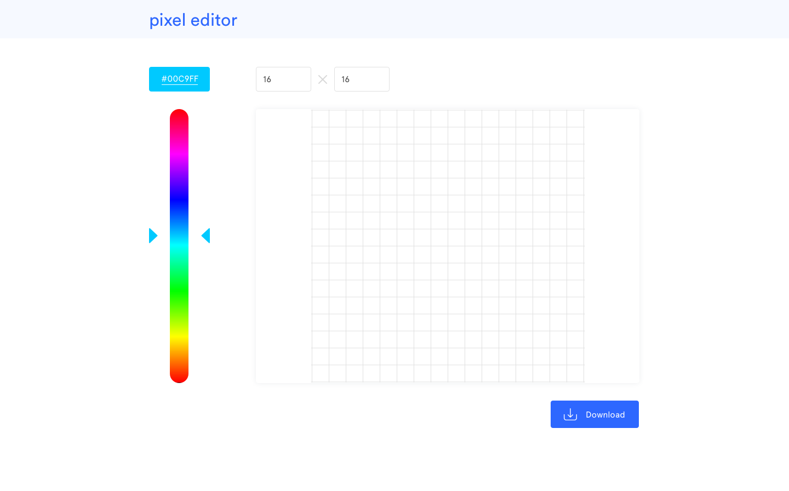

# Pixel editor - iGenius Frontend task

Hey canditate!

Welcome to our little test project! 🚀

We hope that you will feel challenged by this task. Do not worry about not being able to finish all the features, but try to manage the time at your disposal in a smart way. 

## Design

## Features specs 

### Color picker slider 🎨

The slider should present the entire RGB scale of colors, and the user should be able to move the slider to change the select color value.  
On the upper box, the selected color needs to be shown as its hexadecimal representation.  

### Painting grid 📐

The grid on the right needs to respond to user click on a single cell and paint it with the current selected color on the slider.  
The painting grid size is fixed, when the cell number increases the actual dimension of the cell shrinks.  
The text input on the top of the painting grid, define the number of cells that needs to be drawn, and by changing one of them, the other will update with the same value (the grid needs to be a square). 
On dimensions change reset the painting grid.  

## Art download ⬇

When the user has finished creating his valuable piece of art, he should be allowed to download it as a `.png` file.
The download image dimensions needs to be the same as the painting grid ones.  

## What you can use 🤨

* You can use ES6, CSS
* You **can not** use any external libraries 😈
* Feel free to check stuff online but **do not** copy/paste snippets

## How you will be graded ✅

### Your final score depends on how many features you implement...

* Color picker slider
  * RGB scale _(10 points)_
  * Selected color box _(5 points)_
  * Slider _(15 points)_
* Painting grid
  * Empty grid  _(25 points)_
  * Paint cell on click _(25 points)_
  * Dynamic grid size _(10 points)_
* Art download
  * Download image _(5 points)_
  * Image size is the same as painting grid _(5 points)_

### ...and how well you implement them

* Code quality
  * Clean code
  * Modularity
* UI  
  * Follow the design
* Time management
  * It's ok not to finish **all** the features, we care about your code

## How to run 👟

1. we will use the parcel bundler [docs](https://parceljs.org/getting_started.html)
2. `npm i` to install deps
3. `npm start` to start the dev server
4. index.js is the entry file

# Happy coding! 